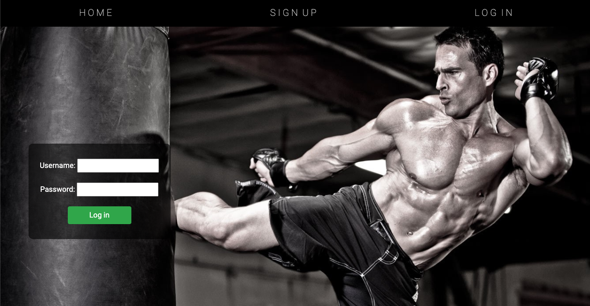

# 🏋️ HP Lifestyle 🏋️‍♀️
Web application where users can go to find articles about leading a healthy lifestyle. Users who create an account and log in are able to use the app to track their workouts and exercises within those workouts. 

---

## ⚙️ Technologies Used ⚙️

- Python
- Django
- Django templates
- dotenv
- Bootstrap
- Heroku (for deployment)

---

## 📸 Screenshots of the deployed app 🏞

Home page with hero image of Arnold

Sign in view of the app

Log in view of the app

Articles on home page

Response form at the bottom of the home page 

Ability to create a new workout

Index view of tracked workouts

Ability to create a new exercise related to a specific workout

Detail page that shows all exercises in a workout

---
## 💪 Getting Started 💪
- Click [here](https://hp-lifestyle.herokuapp.com/) to access the HP Lifestyle app. 
- Users who are not logged in will be able to see the articles on the home screen, but will not be able to create and track their own workouts. 
- Users who are logged in are able to create and track their workouts through the app's "Track my workout" nav link.
- To create a new workout, just click on the "Create a new workout" button inside of "Track my workout." 
- Once you've created a workout, click on the workout title and try creating an exercise to associate it with by selecting "Create an exercise."

---
## Future Enhancements
- Add a few different calculators that would be beneficial for common knowledge when interested in fitness (e.g. BMI, BMR, suggested carolic intake, etc.).
- Refactor code in views.py to be more manageable and helpful.